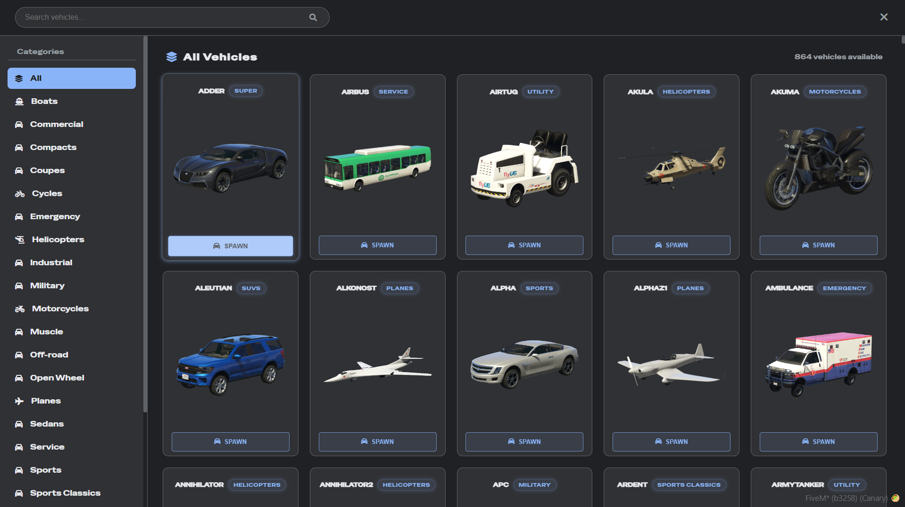

# RUP Vehicle Spawner 🚗✨

A modern, intuitive vehicle spawner menu for FiveM servers with category management and add-on vehicle support.



## Features 🌟
- 🗂️ **Category System**: Organized vehicle classes (Cars, Helicopters, Planes, etc.)
- 🔍 **Instant Search**: Find vehicles by name in real-time
- 🎨 **Dark UI**: Clean, modern interface with dark theme
- 🔑 **Framework Support**: QBcore, QBX, and standalone configurations
- 🔒 **Permission System**: Admin-restricted access
- 🖼️ **Custom Vehicle Images**: Support for add-on vehicle previews
- ⚡ **Optimized Performance**: Smooth animations and lazy loading

## Dependencies 📦
- [ox_lib](https://github.com/overextended/ox_lib) (Required)

## Installation 📦
1. Place `rup-vehiclespawner` in your `resources` directory
2. Add this to your `server.cfg`:
```lua
ensure rup-vehiclespawner
```
3. Configure `Config.lua` for your server needs

## Configuration ⚙️
```lua
Config = {
    --[[ Command Config ]]
    Command = 'vehiclemenu',       --[[ Command name in game, can make whatever 0-0 ]]
    AdminGroups = { 'group.admin'} --[[ Add More If needed, its a table ]]

    --[[ Vehicle Config ]]
    Fuel = 'standalone', --[[ legacy, ox, cdn, standalone]]
    Keys = 'standalone', --[[ qb, qbx, standalone]]
    Warp = true,         --[[ Should player warp into the vehicle on spawn, recommend keeping true :P ]]
}
```

## Add-On Vehicle Images 🖼️
1. Open the folder: `web/images/`
2. Add images named exactly as your vehicle models (e.g.: `police.png`)
3. Supported formats: PNG
4. Recommended size: `512x512px` (will auto-scale)

Example structure:
```
resources/
└── rup-vehiclespawner/
    └── web/
        └── images/
            ├── police.png
            ├── adder.png
            └── fallback.png
```

## Discord License Types 🔐
In `config.lua`, there's a Discord configuration section that includes a `LicenseType` option.  
This is an integer ranging from `0` to `8`, representing different identifier types.

You can find the full list of license types here:  
[License Types](https://docs.fivem.net/docs/scripting-reference/runtimes/lua/functions/GetPlayerIdentifiers/#identifier-types)


## Contributing 🤝
Contributions welcome! Please follow these steps:
1. Fork the repository
2. Create a pull request
4. Ill review 0-0

## License 📄
MIT License - See [LICENSE](LICENSE) for details
